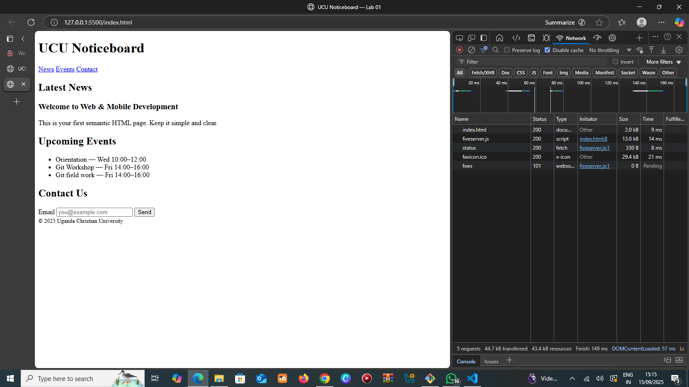

 # Lab 01 — Environment Setup & Git Workflow
 ## Tasks- [x] Install Node LTS, Git, VS Code- [x] Configure Git user and default branch- [x] Initialize repo and create semantic `index.html`- [x] Create `.gitignore` and `README.md`- [x] Open a Pull Request from a feature branch
 ## How to run
 Open `index.html` in a browser (or use VS Code Live Server).
 ## Screenshots 

 1) PR page  2) DevTools → Network tab (HTML request shows 200)
 ## Reflection (100–150 words)- What is an HTTP request/response?- Which status code did you see, and what does it mean?- One thing you learned about Git today.An HTTP request is a message a client (such as a browser) sends to a web server to ask for resources like web pages, images, or data. The server replies with an HTTP response, which contains the requested resource or an error message, along with a status code that explains the result. For example, I observed the status code 200 OK, which means the request was successful, and the server delivered the expected content without issues. These codes are important for troubleshooting since they clearly show whether a request worked, failed, or needs further action. Today, I also learned about Git, a version control system that records project changes in commits. This allows developers to track history, undo mistakes, and collaborate efficiently on the same project without overwriting each other’s work. Git is essential for managing projects in software development.
